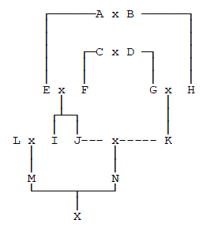
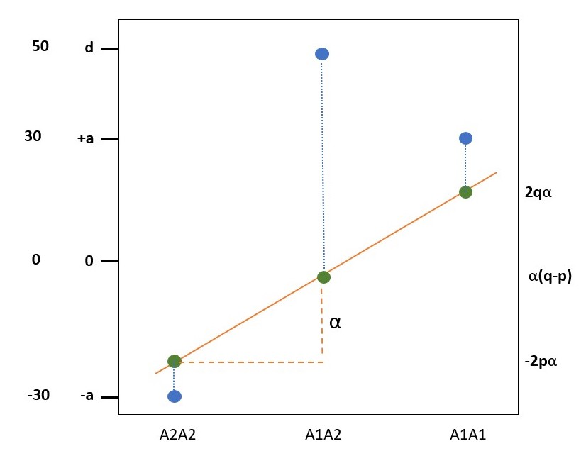

# Exercícios {.unnumbered}

Nessa página, encontram-se as soluções para os exercícios de cada
semana. Essa página é atualizada semanalmente.

## Semana 1: Probabilidade {.unnumbered}

### Q1 {.unnumbered}

**Dois genes ligados (r = 0.20).**

**Pai 1 = AAbb** <br /> **Pai 2 = aaBB**

**Qual é a probabilidade de gametas AB oriundos da autofecundação da
planta F1?**

Gametas produzidos pelo pai 1: Ab <br /> Gametas produzidos pelo pai 2:
aB

Geração $F_1$ = 100% Ab/aB (duplo heterozigoto em fase repulsão).

Da autofecundação de Ab/aB, temos os possíveis gametas:

| Gametas | Tipo         | Frequências               |
|:--------|:-------------|:--------------------------|
| Ab      | Parental     | $\frac{(1-0.2)}{2} = 0.4$ |
| aB      | Parental     | $\frac{(1-0.2)}{2} = 0.4$ |
| AB      | Recombinante | 0.1                       |
| ab      | Recombinante | 0.1                       |

Portanto, a probabilidade de obtermos o gameta AB é de 10%.

### Q2 {.unnumbered}

**Caracter cor de flor em soja:**

**Branca = rr** <br />roxa = R-

**Pai 1 = RR** <br />Pai 2 = rr

**Considerando-se a coleta de 8 plantas ao acaso na geração F2,
pergunta-se:**

**a) Qual a probabilidade de todas as plantas serem de flor roxa?**

Do cruzamento de RR e rr, teremos as seguintes proporções genotípicas e
fenotípicas na F1:

Genotípicas: 100% RrRr <br /> Fenotípicas: 100% roxas

Da autofecundação das plantas da F1 (RrRr x RrRr), teremos as seguintes
proporções genotípicas e fenotípicas na F1:

Genotípicas: $\frac{1}{4}$ RR : $\frac{1}{2}$ Rr : $\frac{1}{4}$ rr
<br /> Fenotípicas: $\frac{3}{4}$ roxas : $\frac{1}{4}$ brancas

Assim, tomando 8 plantas ao acaso, a probabilidade de todas serem de
flor roxa é:

$$
\begin{aligned}
P(8\ roxas) &= (\frac{3}{4})^8 \\
&= 0.1001129 \\
&\approx ~10\%
\end{aligned}
$$

**b) Qual a probabilidade de obter pelo menos uma planta de flor
branca?**

$$
\begin{aligned}
P(pelo\ menos\ uma\ branca) &= 1 - P(8\ roxas) \\
&= 1 - 0.1001129 \\
&\approx 0.8998871 
\end{aligned}
$$

**c) Qual a probabilidade de obter 5 plantas de flor roxa?**

$$
\begin{aligned}
P(5\ roxas) &= (\frac{3}{4})^5 \\
&= 0.2373047 \\
&\approx 23.7\%
\end{aligned}
$$

**d) Se todas as 8 plantas apresentarem flor roxa, qual o nível de
probabilidade de que o pai 2 não possua o genótipo rr?**

100% de probabilidade de que o pai 2 não possui o genótipo rr, pois a
frequência observada de plantas de flor roxa demonstra que todas as
plantas da F2 são *R\_*, o que é incompatível com a possibilidade de um
dos pais ser *rr*.

### Q3 {.unnumbered}

**Considerando-se dois pares de genes independentes em uma população.**

**RR + Rr = plantas resistentes** <br /> **rr = plantas susceptíveis**

**AA + Aa = plantas altas** <br /> **aa = plantas baixas**

**Freq. de plantas susceptíveis = 0.2** <br /> **Freq. de plantas baixas
= 0.4**

**Calcular:**

**a) Qual a proporção de plantas baixas susceptíveis?**

$$
\begin{aligned}
F(baixas\ e\ susceptíveis) &= F(baixas) \times F(susceptíveis) \\
&= 0.4 \times 0.2 \\
&= 0.08
\end{aligned}
$$

**b) Coletando-se 5 plantas, qual a probabilidade de todas serem altas e
susceptíveis?**

$$
\begin{aligned}
P(5\ altas\ e\ susceptíveis) &= P(altas\ e\ susceptíveis)^5 \\
&= (0.6 \times 0.2)^5 \\
&= 0.12^5 \\
&= 0.0000248832 = 0.00249\%
\end{aligned}
$$

**c) Coletando-se 5 plantas, qual a probabilidade de obter:**

-   **01 plantas altas/resistentes:**

```{r}
# P(alta e resistente)
p <- 0.6 * 0.8
p

# P(alta e resistente) tomando-se 5
dbinom(1, 5, p)
```

-   **03 plantas altas/susceptíveis**

```{r}
# P(alta e susceptível)
p <- 0.6 * 0.2
p

# P(3 altas e susceptíveis) tomando-se 5
dbinom(3, 5, p)
```

-   **01 plantas baixas/resistentes**

```{r}
# P(baixa e resistente)
p <- 0.4 * 0.8
p

# P(baixa e resistente) tomando-se 5
dbinom(1, 5, p)
```

### Q4 {.unnumbered}

**Considerando-se um indivíduo hexaploide com o seguinte genótipo:
"AAAaaa"**

**Se o gene "A" se localizar distante do centrômero, considerando uma
autofecundação, calcular:**

**a) Quais os tipos de gametas?**

Segregação cromatídica: AAAaaa = AAAAAAaaaaaa

AAA <br /> AAa <br /> Aaa <br /> aaa

**b) Qual a proporção de gametas "AAa?"**

$$
\begin{aligned}
P(AAa) &= \frac{combinação\ de\ 6\ tomados\ 2\ a\ 2\ \times combinação\ de\ 6\ tomados\ 1\ a\ 1}{combinação\ de\ 12\ tomados\ 3\ a\ 3} \\
&= \frac{{6 \choose 2} \times {6 \choose 1}}{{12 \choose 3}} \\
&= \frac{\frac{6!}{2! \times 4!} \times \frac{6!}{1!\times5!}}{\frac{12!}{3! \times 9!}} \\
\end{aligned}
$$

Resolvendo com R:

```{r}
numerador1 <- choose(6, 2)
numerador2 <- choose(6, 1)
denominador <- choose(12, 3)
pAAa <- (numerador1 * numerador2) / denominador
pAAa
```

Demonstrando o cálculo passo-a-passo:

$$
\begin{aligned}
P(AAa) &= \frac{{6 \choose 2} \times {6 \choose 1}}{{12 \choose 3}} \\
&= \frac{\frac{6!}{2! \times 4!} \times \frac{6!}{1!\times5!}}{\frac{12!}{3! \times 9!}} \\
&= \frac{\frac{6\ 5\ 4!}{2 \times 4! } \times \frac{6\ 5!}{1 \times 5!}} {\frac{12\ 11\ 10\ 9!}{3\ 2\ 1 \times 9!}} \\
&= \frac{\frac{30}{2} \times 6} {\frac{1320}{6}} \\
&= \frac{90}{220} = 0.409
\end{aligned}
$$

**c) Quais as frequências dos genótipos: "aaaaaa" e "AAAaaa" resultantes
da autofecundação?**

Frequências:

| F / M | AAA    | AAa    | Aaa    | aaa    |
|:------|:-------|:-------|:-------|:-------|
| AAA   | AAAAAA | AAAAAa | AAAAaa | AAAaaa |
| AAa   | AAAAAa | AAaAAa | AAaAaa | AAaaaa |
| Aaa   | AAAAaa | AaaAAa | AaaAaa | Aaaaaa |
| aaa   | AAAaaa | AAaaaa | Aaaaaa | aaaaaa |

**aaaaaa:** $\frac{1}{16}$

**AAAaaa:** $\frac{2}{16} = \frac{1}{8}$

### Q5 {.unnumbered}

**Em bovinos, o fenótipo mocho é devido a um alelo dominante, o alelo
recessivo confere o fenótipo chifrudo. Um touro mocho foi cruzado com 10
vacas sabidamente heterozigóticas e todos os descendentes foram mochos.
Qual a probabilidade do touro ser homozigoto?**

Cruzamento: A\_ x Aa     Descendentes: 100% A\_

Se o touro fosse homozigoto, teríamos AA x Aa, que resultaria em 50% AA
: 50% Aa (todos mochos).

Se o touro fosse heterozigoto, teríamos Aa x Aa, que resultaria em 25%
AA : 50% Aa : 25% aa

Se o segundo caso fosse verdadeiro, esperaríamos encontrar 2 touros
chifrudos. Portanto, temos 100% de certeza de que o touro é homozigoto.

## Semana 2: Constituição genética da população {.unnumbered}

### Q1 {.unnumbered}

**Grupo sanguíneo M-N na espécie humana.**

| M    | MN   | N    |
|:-----|:-----|:-----|
| 5000 | 3000 | 2000 |

**a) Qual a freqüência genotípica observada nesta amostra?**

```{r}
total <- 5000 + 3000 + 2000
P <- 5000 / total
H <- 3000 / total
Q <- 2000 / total

P # homozigotos dominantes
H # heterozigotos
Q # homozigotos recessivos
```

**b) Quais são as freqüências gênicas?**

```{r}
p <- P + 0.5 * H
q <- Q + 0.5 * H

p
q
```

**c) Utilizando-se as freqüências gênicas observadas, quais seriam as
freqüências genotípicas esperadas de acordo com a lei de
Hardy-Weinberg?**

```{r}
esperado <- c(P = p^2,
              H = 2*p*q,
              Q = q^2)
esperado
```

**d) Como os valores observados concordam com os valores esperados?**

```{r}
# Teste de qui-quadrado
observado <- c(MM = 5000, MN = 3000, NN = 2000)
HardyWeinberg::HWChisq(observado)
```

O teste resultou em um $\chi^2$ muito elevado, com valor de P \< 0.05,
indicando que a população está em desequilíbrio. O mesmo fato pode ser
constatado pelo valor de D.

### Q2 {.unnumbered}

**Em uma população, 80% das plantas apresentam flor roxa. Cor de flor
branca é governada por um gene autossomal recessivo. Quais as
frequências gênicas, genotípicas e fenotípicas nesta população
considerando E.H.W?**

Dados da questão: 80% B\_ : 20% bb

-   Frequência fenotípica: 80% roxas : 20% brancas

-   Frequência gênica:

$$
\begin{aligned}
q^2 &= 0.2 \\
q &= \sqrt{0.2} \\
q &= 0.44721 \\
\\
p &= 1 - 0.4472136 \\
p &= 0.5527864 
\end{aligned}
$$

-   Frequência genotípica:

$$
\begin{aligned}
P\ (BB) &= 0.5527864^2 = 0.3055728 \\
\\
H\ (Bb) &= 2 \times 0.5527864 \times 0.4472136 = 0.4944271 \\
\\
Q\ (bb) &= 0.4472136^2 = 0.2
\end{aligned}
$$

### Q3 {.unnumbered}

**Qual a freqüência de um gene recessivo em uma população em cruzamento
ao acaso, se metade dos indivíduos normais são portadores
(heterozigotos)?**

$$
\begin{aligned}
\frac{\text{Heterozigotos}}{Normais} = \frac{2pq}{1-q^2} = \frac{2q(1-q)}{1-q^2} = \frac{2q(1-q)}{(1+q)(1-q)} = \frac{2q}{1+q} \\
\end{aligned}
$$

Resolvendo para encontrar q:

$$
\begin{aligned}
\frac{2q}{1+q} &= \frac{1}{2} \\
4q &= 1+q \\
3q &= 1 \\
q &= \frac{1}{3}
\end{aligned}
$$

### Q4 {.unnumbered}

**Três alelos (A, B, e C) presentes em uma população. Todos os genótipos
foram identificados por eletroforese e as freqüências na amostra
analisada foram:**

| Genótipo | Frequência |
|:---------|:-----------|
| AA       | 9.6        |
| AB       | 48.3       |
| BB       | 34.3       |
| AC       | 2.8        |
| BC       | 5.0        |
| CC       | 0.0        |

**a) Quais são as freqüências gênicas na amostra?**

Como a frequência de um gene é igual à frequência de homozigots + metade
da frequência de heterozigotos, temos:

$$A = 0.096 + \frac{1}{2}(0.483 + 0.028) = 0.3515$$

$$B = 0.343 + \frac{1}{2}(0.483 + 0.05) = 0.6095$$

$$C = 0.0 + \frac{1}{2}(0.028 + 0.05) = 0.039$$

**b) Porque não se observou indivíduos do genótipo CC?**

A frequência esperada de indivíduos CC é $C^2 = 0.039^2 = 0.0015$. Como
o tamanho amostral é de 178 indivíduos, espera-se encontrar
$178 \times 0.0015 = 0.27$ indivíduos CC (menos de 1). Portanto, a
frequência observada é esperada. Se o tamanho amostral fosse maior,
poderíamos observar indivíduos CC.

### Q5 {.unnumbered}

**Um gene "A" ligado ao sexo. Supondo P(A) = 0.2 nos machos e 1,0 nas
fêmeas na geração t1:**

**a) Qual será a freqüência do gene A na população como um todo quando
em E.H.W.?**

Implementando uma função para calcular frequências de genes ligados ao
sexo em machos e fêmeas:

```{r}
options(scipen = 99999)
calc_freq_xlinked <- function(pm0 = NULL, pf0 = NULL, 
                              generations = 10) {
    df <- data.frame(
        Generation = seq_len(generations),
        pf = c(pf0, rep(NA, generations - 1)),
        pm = c(pm0, rep(NA, generations - 1))
    )
    for(t in 2:generations) {
        df[t, "pf"] <- (df[t-1, "pm"] + df[t-1, "pf"]) / 2
        df[t, "pm"] <- df[t-1, "pf"]
    }
    df$difference <- df$pf - df$pm
    return(df)
}

# Aplicando função com dados do enunciado
calc_freq_xlinked(pm0 = 0.2, pf0 = 1, generations = 15)
```

Para verificar a frequência de A no equilíbrio, vamos simular 100
gerações de cruzamento ao acaso e obter a frequência na geração 100.

```{r}
calc_freq_xlinked(pm0 = 0.2, pf0 = 1, generations = 100)$pf[100]
```

Verificando de forma visual:

```{r}
suppressPackageStartupMessages(library(tidyverse))

# Simulando 20 gerações
freq50 <- calc_freq_xlinked(pm0 = 0.2, pf0 = 1, generations = 20)

# Visualizando simulação
freq50[, 1:3] %>%
    tidyr::pivot_longer(
        !Generation, names_to = "sex", values_to = "freq"
) %>%
    mutate(sex = str_replace_all(sex, c("pf" = "Fêmea",
                                        "pm" = "Macho"))) %>%
    ggplot(., aes(x = Generation, y = freq)) +
    geom_point(aes(color = sex)) +
    geom_line(aes(group=sex, color=sex)) +
    scale_color_manual(values = c("grey40", "goldenrod")) +
    theme_bw() +
    ylim(0,1) + 
    labs(
        color = "Sexo",
        title = "Frequência do gene A ao longo de 20 gerações",
        subtitle = "O gene A é ligado ao sexo",
        x = "Geração", y = "Frequência"
    )
```

**b) Após três gerações de acasalamento ao acaso, (t4), qual será a
freqüência do gene "A" nos machos (pm) e nas fêmeas (pf)?**

```{r}
calc_freq_xlinked(pm0 = 0.2, pf0 = 1, generations = 4)
```

pm = 0.8    pf = 0.7

**c) Qual a proporção do grau de desequilíbrio (pm - pf) da geração t4
em relação à geração t1?**

O desequilíbio na geração t4 equivale a 1/8 do desequilíbrio na geração
t1.

### Q6 {.unnumbered}

**Na geração parental "0", 30% dos genótipos são "AAbb" e 70% são
"aaBB". Considerando cruzamento ao acaso em gerações sucessivas
pergunta-se:**

**Qual a freq. do genótipo "AABB" na progênie da geração 2 (após duas
gerações de cruzamento ao acaso), se os locos estiverem (1) não ligados,
(2) ligados com uma freqüência de recombinação de 10%? Idem para o
genótipo AaBb.**

30% Ab/Ab : 70% aB/aB, portanto:

$p_A$ = 0.3   $q_A$ = 0.7 <br /> $p_B$ = 0.7   $q_B$ = 0.3

| Gametas    | AB              | Ab              | aB              | ab              |
|------------|-----------------|-----------------|-----------------|-----------------|
| Freq. EHW  | $p_Ap_B = 0.21$ | $p_Aq_B = 0.09$ | $q_Ap_B = 0.49$ | $q_Aq_B = 0.21$ |
| Freq. obs. | r = 0           | s = 0.3         | t = 0.7         | u = 0           |
| Dif. EHW   | +D = 0.21      |  -D = -0.21     |  -D = -0.21      |  +D = 0.21     |


Agora que conhecemos $D_0$, podemos calcular $D_2$ nos dois cenários apresentados no enunciado:

- *Loci* não ligados:

$$
\begin{aligned}
D_t &= D_0(1-c)^t \\
D_2 &= 0.21(1-0.5)^2 \\
&= 0.21 \times 0.25 \\
&= 0.0525
\end{aligned}
$$

- *Loci* ligados com c = 0.1:

$$
\begin{aligned}
D_2 &= 0.21(1-0.1)^2 \\
&= 0.21 \times 0.81 \\
&= 0.1701
\end{aligned}
$$


Sendo r a frequência do gameta AB, a frequência do genótipo AABB será $r^2$.

- Frequência de AABB para *loci* não ligados:

$$
\begin{aligned}
r &= \hat{r} - D \\
&= 0.21 - 0.0525 \\
&= 0.1575 \\
\\
r^2 &= 0.02480625
\end{aligned}
$$

- Frequência de AABB para *loci* ligados com c = 0.1:

$$
\begin{aligned}
r &= 0.21 - 0.1721 \\
&= 0.0379 \\
\\
r^2 &= 0.00143641
\end{aligned}
$$

Para o genótipo AaBb (duplo heterozigoto), temos 4 possíveis combinações de gametas:

1. AB e ab
2. Ab e aB
3. aB e Ab
4. ab e AB

- Frequência para *loci* não ligados:

```{r}
# Frequências gaméticas na geração 2 para genes independentes
D <- 0.0525
AB <- 0.21 - D
Ab <- 0.09 + D
aB <- 0.49 + D
ab <- 0.21 - D

# Soma dos produtos
(AB * ab) + (Ab * aB) + (aB * Ab) + (ab * AB)
```

- Frequência para *loci* ligados com c = 0.1:

```{r}
# Frequências gaméticas na geração 2 para genes ligados
D <- 0.1701
AB <- 0.21 - D
Ab <- 0.09 + D
aB <- 0.49 + D
ab <- 0.21 - D

# Soma dos produtos
(AB * ab) + (Ab * aB) + (aB * Ab) + (ab * AB)
```


## Semana 3: Mudanças na Frequência Gênica {.unnumbered}

### Q1 {.unnumbered}

**Flor branca ocorre normalmente em uma população de plantas de flores roxas com uma freq. de 3e-04. Uma planta de flor branca produz em média 200 sementes, enquanto que as de flor roxa produzem 600.**


**a) Considerando a flor branca o produto de um gene recessivo, considerando ainda a pop. em equilíbrio, qual a taxa de mutação necessária para balancear o efeito da seleção?**

*Fitness* das plantas de flor branca = $\frac{200}{600} = 0.3333333$.

Logo, $s = 1 - 0.3333333 = 0.6666667$.

No equilíbrio, a perda por seleção deve ser igual ao ganho por mutação. Ou seja:

$$
\begin{aligned}
u &= sq^2 \\
u &= 0.6666667 \times 3e-04 \\
u &= 2e-04
\end{aligned}
$$

**b) Se flor branca fosse resultante de um gene de dominância completa, qual seria a taxa de mutação para manter equilíbrio?**

Considerando que homozigotos serão muito raros e, portanto, desprezíveis, teremos:

$$
\begin{aligned}
u &= \frac{1}{2}sH \\
u &= \frac{1}{2} \times 0.6666667 \times 3e-04 \\
u &= 1.5e-04
\end{aligned}
$$

### Q2 {.unnumbered}

**Uma doença causada por um gene recessivo autossomal.**

**Indivíduos doentes não deixam descendentes. Porém indivíduos doentes tratados deixam a metade de descendentes em relação aos indivíduos normais.**

**Considerando que no presente, não existe tratamento e a população se encontra em equilíbrio, quais as consequências a longo prazo, se aplicarmos o tratamento nos indivíduos doentes? Considere que a pop. no presente se encontra em equilíbrio (Mut. X seleção) e que após o tratamento atingirá um novo equilíbrio.**

A frequência dos homozigotos recessivos (afetados pela doença) é $q^2 = \frac{u}{s}$.

Sem tratamento, s = 1. Com tratamento, s = 0.5 (metade sobrevive). Portanto, tratar os indivíduos afetados faria a população de homozigotos recessivos dobrar de tamanho no novo equilíbrio em consequência da mutação.


### Q3 {.unnumbered}

**Vantagem do heterozigoto.**

**Proporção de morte dos homozigotos dominantes é de 70%. No equilíbrio, o gene dominante atingiu uma freq. de 0.20. Qual a percentagem de perda de indivíduos? (perda genética: L).**

Se 70% dos indivíduos morrem, s = 0.7.

$$
\begin{aligned}
L &= s_1p \\
L &= 0.7 \times 0.2 \\
L &= 0.14 = 14\%
\end{aligned}
$$


### Q4 {.unnumbered}

**Se um alelo A sofre mutação para a com uma freq. de 1 para 10.000 e no sentido oposto de 1 para 100.000, e se os três genótipos possuem mesma fitness, qual seria a freq. genotípica no equilíbrio em uma população em acasalamento ao acaso?**

No equilíbrio, $pu = qv$. Logo, $q = \frac{u}{u+v}$. Portanto:

$$
\begin{aligned}
q &= \frac{1e-04}{1e-04 + 1e-05} \\
q &= \frac{1}{1 + 1e-01} \\
q &= 0.90909
\end{aligned}
$$

Se $q = 0.90909$, então $p = 1 - 0.90909 = 0.09091$. Portanto:

$$
\begin{aligned}
AA &= p^2 = 0.008264628 \\
Aa &= 2pq = 0.1652907 \\
aa &= q^2 = 0.8264446
\end{aligned}
$$

Conferindo se as frequências somam a 1:

```{r}
0.008264628 + 0.1652907 + 0.8264446
```

### Q5 {.unnumbered}

**Referindo-se ao problema 4, qual seria a conseqüência se a taxa de mutação fosse duplicada em ambos os sentidos?**

Como as taxas seriam aumentadas na mesma proporção (duas vezes) em ambos os sentidos, nada aconteceria. As frequências do equilíbrio seriam as mesmas. 

### Q6 {.unnumbered}

**Em um estoque de mutante autossomal dominante homozigoto, ocorreu contaminação com tipos selvagens. Após 15 gerações, alguns indivíduos selvagens foram observados contaminando o estoque de mutantes. Supondo que:**

1. **Em cada geração, 15% dos indivíduos eram contaminantes;**

2. **Todos os contaminantes eram selvagens homozigotos;**

3. **Não havia diferença de fitness entre os diferentes genótipos.**

**Pergunta-se:**

**a) Proporção de indivíduos selvagens após as 15 gerações de contaminação.**

Mudança nas frequências gênicas devido a migração na geração n:

$$
(q_n - q_m) = (1-m)^n(q_0-q_m)
$$

Sendo q o alelo mutante, $q_0 = 1$ e $q_m = 0$. Assim, na geração 15, teremos:

$$
\begin{aligned}
(q_{15} - 0) &= (1-0.15)^{15}(1-0) \\
q_{15} &= 0.08735422
\end{aligned}
$$

Sendo $p_{15} = 1-q_{15} = 0.9126458$, a proporção de indivíduos selvagens será $p^2 = 0.8329224 = 83.29\%$.

**b) A proporção de heterozigotos entre indivíduos de fenótipo mutante.**

Frequência de mutantes = $1-p^2 = 0.1670 = 16.70\%$

Frequência de heterozigotos = $2pq = 0.1594 = 15.94\%$

Frequência de heterozigotos entre mutantes = $\frac{0.1594}{0.1670} = 0.9543 = 95.43\%$


## Semana 4: Processos dispersivos {.unnumbered}

### Q1 {.unnumbered}

**Um caráter codominante, determinado pelos alelos A1 e A2 em um loco. Em uma amostra determinou-se os seguintes quantitativos:**

| A1A1| A1A2| A2A2| Total|
|:----|:----|:----|:----|
|180|713|1708|2601|

**a) As freq. correspondentes são compatíveis com uma amostra vinda de uma pop. em cruzamento ao acaso?**

Se a população estivesse em cruzamento ao acaso, as frequências observadas seriam iguais às frequências no equilíbrio de Hardy-Weinberg. Verificando se a população está em equilíbrio:

```{r}
library(HardyWeinberg)
frequencies <- c(AA = 180, Aa = 713, aa = 1708)
HWChisq(frequencies)
```

A estatística $\chi^2$ é muito elevada, com *P* < 0.05, indicando que a população não está em equilíbrio. O mesmo pode ser observado pelo valor de D.

**b) O que as freq. sugerem sobre a estrutura genética da população?**

As frequências sugerem que a população não está em cruzamento ao acaso, e que essa pode ter sido formada pela união de sub-populações com frequências gênicas diferentes entre si.

### Q2 {.unnumbered}

**Se uma população é mantida através de acasalamento ao acaso envolvendo 40 pares de indivíduos tomados ao acaso de uma grande população, qual será o coef. de endogamia “F” após 5 e após 10 gerações?**

Com N = 80, temos $\Delta{F} = \frac{1}{2N} = \frac{1}{160} = 0.00625$

Sendo $F_t = 1 - (1-\Delta{F})^t$, temos:

$$
\begin{aligned}
F_5 = 1 - 0.99375^5 = 0.0308618 \\
\\
F_{10} = 1 - 0.99375^10 = 0.0607712
\end{aligned}
$$

Implementando função para calcular $F_t$ para dado N:

```{r}
calc_inbreeding <- function(N = NULL, t = NULL) {
  deltaF <- 1 / (2*N)
  Ft <- 1 - (1 - deltaF)^t
  return(Ft)
}

# Testando
calc_inbreeding(N = 80, t = 5)
calc_inbreeding(N = 80, t = 10)
```


### Q3 {.unnumbered}

**Um grupo de pesquisadores, cada um recebeu 20 indivíduos tomados ao acaso de uma grande população que continha um alelo mutante com uma frequência gênica = 0.2. Cada pesquisador conduziu sua sub-população mantendo 20 indivíduos ao acaso para ser progenitores da próxima geração. Após 10 gerações cada pesquisador determinou a freq. gênica de sua sub-pop. através da avaliação de 20 indivíduos da progênie.**

**a) Qual seria a freq. gênica média encontrada?**

A frequência gênica média seria igual à frequência gênica inicial. Ou seja:

$\bar{p} = p_0 = 0.2$.

**b) Quanta variação seria esperada entre pesquisadores, quanto à suas estimativas de freq. gênica?**

Após 10 gerações, 11 gerações de deriva teriam ocorrido nas amostras de cada pesquisador. Calculando $F_{11}$ com a função implementada anteriormente:

```{r}
calc_inbreeding(N = 20, t = 11)
```

Sabendo que $\sigma^2_q = p_0q_0F_t$, temos:

$$
\begin{aligned}
\sigma^2_q &= 0.2 \times 0.8 \times 0.2430786 \\
&= 0.03889258
\end{aligned}
$$

Logo, a variância esperada seria $\sigma^2_q = 0.03889258$, e o desvio padrão seria $\sigma_q = \sqrt{0.03889258} = 0.197212$.


### Q4 {.unnumbered}

**Se o número dos três genótipos contados pelos pesquisadores no experimento do problema 3 fossem acumulados, qual seria a freq. genotípica resultante?**

Sendo $p_0 = 0.2$ e $q_0 = 0.8$:

$$
\begin{aligned}
A_1A_1 &= p_0^2 + \sigma^2_q = 0.04 + 0.03889258 = 0.07889258 \\
A_1A_2 &= 2p_0q_0 - 2\sigma^2_q = 2 \times 0.2 \times 0.8 - 2 \times 0.03889258 = 0.2422148 \\
A_2A_2 &= q_0^2 + \sigma^2_q = 0.64 + 0.03889258 = 0.6788926
\end{aligned}
$$

Conferindo se as frequências somam a 1:

```{r}
0.07889258 + 0.2422148 + 0.6788926
```


### Q5 {.unnumbered}

**Um estoque de animais consistiu de 50 sub-pop. todas derivadas de uma mesma pop. base, mas mantidas para cruzamentos separadamente (por sub-pop.). O estoque foi polimórfico para um loco autossomal com dois alelos, A1 e A2. Após 25 gerações os animais foram avaliados em todas as sub. Pop. obtendo-se a seguinte freq. genotípica.**

|A1A1 | A1A2| A2A2|Total|
|:----|:----|:----|:----|
| 42  | 76  | 448 | 566 |

**Calcular o coef. de endogamia com base nos números apresentados.**

$$
\begin{aligned}
P &= \frac{42}{566} = 0.0742 \\ 
H &= \frac{76}{566} = 0.1343 \\
Q &= \frac{448}{566} = 0.7915 \\
\\
p &= P + \frac{1}{2} H = 0.1413 \\
q &= Q + \frac{1}{2} H = 0.8587
\end{aligned}
$$

Com essas frequências gênicas, a frequência de heterozigotos em uma população em cruzamento ao acaso é $2pq = 0.2427$. Logo:


$$
\begin{aligned}
P_t &= 1-F_t = \frac{H_t}{H_0} \\
&= \frac{0.1343}{0.2427} = 0.553 \\
\\
F &= 1-P = 0.447
\end{aligned}
$$


## Semana 5: Populações pequenas {.unnumbered}

### Q1 {.unnumbered}

**Quatro sub-populações são mantidas em cruzamento ao acaso separadamente. Todas as subpopulações possuem 40 fêmeas, mas um número diferente de machos sendo 4, 8, 2 e 6 respectivamente. Calcular o tamanho efetivo (Ne) de cada sub-população e o coeficiente de endogamia (F) após 5 gerações.**

Sabendo que $N_e = \frac{4N_m N_f}{N_m + N_f}$, $\Delta{F} = \frac{1}{2N_e}$, e $F_t = 1 - ( 1 - \Delta{F})^t$.

Implementando função para calcular $N_e$ e coeficiente de endogamia após t gerações.

```{r}
calc_Ne <- function(m = NULL, f = NULL) {
  ne <- (4 * m * f) / (m + f)
  return(ne)
}

calc_deltaF <- function(m = NULL, f = NULL) {
  ne <- calc_Ne(m, f)
  deltaF <- 1 / (2 * ne)
  return(deltaF)
}

calc_inbreeding_sp <- function(m = NULL, f = NULL, t = NULL) {
  ne <- calc_Ne(m, f)
  deltaF <- 1 / (2 * ne)
  Ft <- 1 - (1 - deltaF)^t
  return(Ft)
}


# Aplicando funções
# Calculando Ne
calc_Ne(4, 40) # pop. 1
calc_Ne(8, 40) # pop. 2
calc_Ne(2, 40) # pop. 3
calc_Ne(6, 40) # pop. 4

# Calculando delta F
calc_deltaF(4, 40) # pop. 1
calc_deltaF(8, 40) # pop. 2
calc_deltaF(2, 40) # pop. 3
calc_deltaF(6, 40) # pop. 4

# Calculando F(t = 5)
calc_inbreeding_sp(4, 40, t = 5) # pop. 1
calc_inbreeding_sp(8, 40, t = 5) # pop. 2
calc_inbreeding_sp(2, 40, t = 5) # pop. 3
calc_inbreeding_sp(6, 40, t = 5) # pop. 4
```

| Populacao | N machos | N femeas | $N_e$ | $\Delta{F}$ | F(t = 5) |
|:----------|:---------|:---------|:------|:------------|:---------|
|     1     |     4    |    40    | 14.55 |    0.034    |  0.160   |
|     2     |     8    |    40    | 26.67 |    0.019    |  0.090   |
|     3     |     2    |    40    | 7.62  |    0.066    |  0.288   |
|     4     |     6    |    40    | 20.87 |    0.024    |  0.114   |


### Q2 {.unnumbered}

**Suponha que uma população se mantenha isolada durante 6 gerações, com o número de pares de acasalamento nas sucessivas gerações sendo 2, 4, 50, 100, 150 e 400. Calcular Ne e delta F.**

Implementando função para calcular $N_e$ para números desiguais em sucessivas gerações:

```{r}
calc_Ne_unequal_suc <- function(t = NULL, N = NULL) {
  sums <- sum(sapply(N, function(x) 1/x))
  one_over_Ne <- (1 / t) * sums
  Ne <- 1 / one_over_Ne
  return(Ne)
}

pares <- c(2, 4, 50, 100, 150, 400)
N <- pares * 2 

# Aplicando função
calc_Ne_unequal_suc(t = 6, N = N)
```

$\Delta{F} = \frac{1}{2N_e} = \frac{1}{30.41} = 0.0329$

### Q3 {.unnumbered}

**Calcular as taxas de endogamia (delta F) em duas populações de plantas, uma das quais é auto-fertil e a outra auto-esteril, quando ambas são propagadas por polinização ao acaso entre 40 plantas individuais.**

- Auto-fértil:

$N_e = N$ (como uma população ideal), logo $\Delta{F} = \frac{1}{2N_e} = \frac{1}{80} = 0.0125$ ou 1.25%.

- Auto-estéril:

$\Delta{F} = \frac{1}{(2N + 1)} = \frac{1}{81} = 0.0123$ ou 1.23%.

### Q4 {.unnumbered}

**Deseja-se manter o grau de endogamia a um mínimo ao longo das gerações através do uso de 10 pares de indivíduos a cada geração. Em uma determinada geração, os pares falharam em deixar os exatos dois descendentes para a próxima geração. Os números de descendentes por par foram: 0, 1, 1, 1, 2, 2, 3, 3, 3 e 4. Utilizando-se tal descendência como pais, qual o Ne em tal geração?**


Sabendo que $N_e = \frac{4N}{V_k + 2}$:


```{r}
# Dados do enunciado
N <- 10 * 2
k <- c(0, 1, 1, 1, 2, 2, 3, 3, 3, 4)

get_variance <- function(k = NULL) {
  mean_k <- mean(k)
  dev_k <- k - mean_k
  var_k <- sum(dev_k^2)
  return(var_k)
}

kvar <- get_variance(k)
kvar

Vk <- kvar / 10
Vk

Ne <- 4 * N / (Vk + 2)
Ne
```


### Q5 {.unnumbered}

**Considerando ainda o problema anterior (4), qual seria o Ne se de fato cada par deixasse exatamente 2 descendentes para serem usados como pais da próxima geração?**

$N_e = 2N - 1 = 40 - 1 = 39$

### Q6 {.unnumbered}

**Qual o Coef. de Endogamia (F), no equilíbrio, considerando os processos dispersivos e os processos sistemáticos (migração e mutação) ocorrendo ao mesmo tempo, considerando Ne = 200; m = 0,20 e u + v = 0,00001?**

$$
\begin{aligned}
F &= \frac{1}{4N_e (u + v + m) + 1} \\
&= \frac{1}{4 \times 200 (0.00001 + 0.20) + 1} \\
&= \frac{1}{800 \times 0.20001 + 1} \\
&= \frac{1}{161.008} = 0.006210872
\end{aligned}
$$

## Semana 6: Populações pequenas com pedigree {.unnumbered}

### Q1 {.unnumbered}

**Calcular o coef. de endogamia (F) de indivíduos resultantes dos seguintes cruzamentos:**

- **Entre primos de primeiro grau (simples).**

$(\frac{1}{2})^5 + (\frac{1}{2})^5 = \frac{1}{16}$


- **Entre primos de primeiro grau (duplo).**

$4 \times (\frac{1}{2})^5 = \frac{1}{8}$

- **Entre tio e sobrinha.**

$2 \times (\frac{1}{2})^4 = \frac{1}{8}$

- **Entre pai e filho, sendo o pai uma linha pura**

$\frac{1}{2}$

- **Entre pai e filho, correspondendo às gerações F2 e F3, sendo os pais originais, meios irmãos, sendo o pai comum, uma linha pura.**

$\frac{1}{8}$

- **Entre pai e filho, correspondendo às gerações F3 e F4, sendo os pais originais não endogâmicos.**

$\frac{1}{4}$


### Q2 {.unnumbered}

**Qual o coeficiente de parentesco entre crianças oriundas de gêmeos idênticos casados com indivíduos não aparentados.**

Como os gêmeos são, geneticamente, o mesmo indivíduo, as crianças são tratadas como meio-irmãos (filhos de um mesmo pai, mas mães diferentes). Portanto, o coeficiente de parentesco é $\frac{1}{8}$.

### Q3 {.unnumbered}

**Calcule o coef. de endogamia do indivíduo X, utilizando-se os dois métodos ("path coefficient" e coef. de parentesco).**

```{r echo=FALSE, out.width='50%'}

```

Simplificando o heredograma para o formato padrão, similar a um grafo:

```{r}
suppressPackageStartupMessages(library(igraph))
df <- data.frame(
  from = c("A", "A", "B", "B", "C", "C", "D", "D",
           "E", "E", "F", "F", "H", "G", 
           "L", "I", "J", "K", "M", "N"),
  to = c("E", "H", "E", "H", "F", "G", "F", "G",
         "I", "J", "I", "J", "K", "K",
         "M", "M", "N", "N", "X", "X")
)
graph <- graph_from_data_frame(df, directed=FALSE)

# Create layers
#layer 1: ABCD;layer 2: EFGH;layer 3: LIJK;layer 4: MN;layer 5: X
layers <- c(rep(1, 4),
            rep(2, 4),
            rep(3, 4),
            rep(4, 2),
            5)
layout <- layout_with_sugiyama(graph, layers = layers)
plot(graph, layout = cbind(layers, layout$layout[,1]),
     vertex.color = "brown2", vertex.label.color = "white",
     vertex.size = 30)
```

Caminhos possíveis:

- $MI\bar{E}JN$
- $MI\bar{F}JN$
- $MIE\bar{A}HKN$
- $MIE\bar{B}HKN$
- $MIF\bar{C}GKN$
- $MIF\bar{D}GKN$

Logo, 

$$
\begin{aligned}
F_x &= 2(\frac{1}{2})^5 + 4(\frac{1}{2})^7 \\
&= \frac{1}{16} + \frac{1}{32} \\
&= \frac{3}{32} = 0.09375
\end{aligned}
$$

### Q4 {.unnumbered}

**Duas linhas puras são cruzadas para obter a geração F1. Os indivíduos F1 são autofecundados para obter a geração F2. Indivíduos F2 são retrocruzados com o F1 e com um dos progenitores. Quais são os coeficientes de endogamia das progênies oriundas dos dois retrocruzamentos?**

Chamando as linhas puras de A e B, os indivíduos da geração F2 produzem gametas A e B em proporções iguais aos indivíduos da F1, pois o retrocruzamento da F2 com F1 gera 1/4 AA e 1/4 BB, ou seja, 1/2 de homozigotos. De forma similar, o retrocruzamento de F2 com A gera 1/2 AA. Logo, ambos os retrocruzamentos produzem 50% de homozigotos, então o coeficiente de endogamia é 0.5.


### Q5 {.unnumbered}

**Uma população de plantas foi submetida a endogamia via cruzamento entre irmãos completos durante 15 gerações. Após este estádio, uma amostra de tamanho efetivo de 30 plantas foi mantida por mais 20 gerações. Qual o coeficiente de endogamia resultante?**

Implementando função para calcular o coeficiente de endogamia de cruzamentos entre irmãos completos após t gerações:

```{r}
F_full_sib <- function(Ft_1 = NULL, Ft_2 = NULL) {
  Fx <- 0.25 * (1 + 2*Ft_1 + Ft_2)
  return(Fx)
}

sim_inbreeding_full_sib <- function(F0 = 0, t = 10) {
  f1 <- F_full_sib(F0, 0)
  df <- data.frame(
    geracao = c(0, seq_len(t)),
    Fx = c(0, f1, rep(NA, t-1))
  )
  for(gen in 2:t+1) {
    df$Fx[gen] <- F_full_sib(df$Fx[gen-1], df$Fx[gen-2])
  }
  return(df)
}

# Calculando para 15 gerações
sim_inbreeding_full_sib(t=15)
```

Após 15 gerações, o coeficiente de endogamia é 0.9605713. Logo, $P_{BA} = 1 - 0.9605713 = 0.0394287$.

Em seguida, o coeficiente de endogamia de uma população com $Ne = 30$ mantida por 20 geracões será:

$$
\begin{aligned}
\Delta{F} &= \frac{1}{2Ne} = \frac{1}{60} = 0.01666667 \\
\\
F_t &= 1 - (1 - \Delta{F})^t \\
&= 1 - 0.9833333^{20} \\
&= 1 - 0.7145209 = 0.2855 \\
\\
P_{XB} &= 1 - 0.2855 = 0.7145
\end{aligned}
$$

Portanto, $P_{XA} = 0.7145 \times 0.0394287 = 0.02817$. Finalmente, o coeficiente de endogamia resultante será $1-P_{XA} = 0.97183$.


## Semana 7: Variação contínua {.unnumbered}

### Q1 {.unnumbered}

**Calcular a média, variância e herdabilidade com base nos seguintes dados relativos a tempo de florescimento em arroz: (Vencovsky R. ). Interprete as diferenças de variância.**

- **Geração F1:**

81 79 79 77 78 79 79 83 79 79 78 79 79 79 79 81 79 85 79 81 79 81 81 79

- **Geração F2:**

124 86 91 107 83 84 89 98 77 84 78 96 106 107 79 108 101 104 82 104 79

84 104 79 84 79 79 76 86 79 85 95 84 103 81 107 99 81 78 102 81 107

84 95 86 76 84 84 100 100 83 89 101 81 106 83 125 88 99 81 100 86 81

```{r}
# Dados
f1 <- c(81, 79, 79, 77, 78, 79, 79, 83, 79, 79, 78,
        79, 79, 79, 79, 81, 79, 85, 79, 81, 79, 81,
        81, 79)

f2 <- c(124, 86, 91, 107, 83, 84, 89, 98, 77, 84, 78,
        96, 106, 107, 79, 108, 101, 104, 82, 104, 79,
        84, 104, 79, 84, 79, 79, 76, 86, 79, 85, 95, 
        84, 103, 81, 107, 99, 81, 78, 102, 81, 107,
        84, 95, 86, 76, 84, 84, 100, 100, 83, 89, 101, 
        81, 106, 83, 125, 88, 99, 81, 100, 86, 81)

# Calculando médias e variâncias
df_summary <- data.frame(
  Geracao = c("F1", "F2"),
  Media = c(mean(f1), mean(f2)),
  Variancia = c(var(f1), var(f2))
)
df_summary
```

Calculando herdabilidade na F2:

$$
\begin{aligned}
VG &= VF - VM \\
&= 140.69 - 2.93 \\
&= 137.76
\\
\\
h^2 &= \frac{VG}{VF} \\
&= \frac{137.76}{140.69} = 0.979
\end{aligned}
$$

A variância fenotípica é bem maior na F2, pois há variância genotípica + variância do ambiente. Na F1, não há variância genotípica, pois toda população é formada por indivíduos heterozigotos. Portanto, toda a variância na F1 é consequência do efeito do ambiente, apenas. 

### Q2 {.unnumbered}

**Calcular a distribuição de freqüência e construir um histograma de uma característica métrica governada por seis locos independentes, dois alelos por loco e dominância completa. Cada loco quando homozigoto recessivo reduz o valor fenotípico em dez unidades. Considere a freqüência dos alelos recessivos de 0.4 nos respectivos locos.**

```{r}
# Implementando função para calcular frequências de cada classe
get_freq_binom <- function(n_loci = 6, q = 0.4) {
  a <- q^2
  freq <- round(dbinom(0:n_loci, n_loci, prob = a), 3)
  df_freq <- data.frame(
    class = 0:n_loci,
    n = freq
  )
  return(df_freq)
}

# Obter frequências relativas de cada classe
get_freq_binom(n_loci = 6, q = 0.4)


# Construindo histograma
df <- data.frame(x = rbinom(10^6, size = 6, prob = 0.4^2))
df %>%
  ggplot(., aes(x = x, y = ..count.. / sum(..count..) * 100)) +
  geom_histogram(bins = 7, fill = "grey60", color = "black") +
  theme_bw() +
  scale_x_continuous(breaks = 0:6) +
  labs(x = "Classes",
       y = "Porcentagem (%)",
       title = "Distribuição de frequência para característica métrica",
       subtitle = "Característica governada por 6 loci de 2 alelos, com q = 0.4")
```


### Q3 {.unnumbered}

**Idem anterior considerando: em três locos a freq. dos alelos recessivos = 0.3 e nos outros três de 0.8.**

```{r}
# Calculando frequências para cada caso
x <- get_freq_binom(3, 0.3)$n
names(x) <- 0:3
y <- get_freq_binom(3, 0.8)$n
names(y) <- 0:3

# Combinando frequências
suppressPackageStartupMessages(library(tidyverse))
freqs <- outer(x, y, "*") %>%
  reshape2::melt(.) %>%
  mutate(class = Var1 + Var2) %>%
  group_by(class) %>%
  summarise(n = round(sum(value), 3)) 

freqs

# Representando graficamente
vals <- c(
  round(rep(0, freqs[1,2] * 10^6)),
  round(rep(1, freqs[2,2] * 10^6)),
  round(rep(2, freqs[3,2] * 10^6)),
  round(rep(3, freqs[4,2] * 10^6)),
  round(rep(4, freqs[5,2] * 10^6)),
  round(rep(5, freqs[6,2] * 10^6)),
  round(rep(6, 1))
)
df_q3 <- data.frame(x = vals)
df_q3 %>%
  ggplot(., aes(x = x, y = ..count.. / sum(..count..) * 100)) +
  geom_histogram(bins = 7, fill = "grey60", color = "black") +
  theme_bw() +
  scale_x_continuous(breaks = 0:6) +
  labs(x = "Classes",
       y = "Porcentagem (%)",
       title = "Distribuição de frequência para característica métrica",
       subtitle = "6 loci de 2 alelos, com q = 0.3 para 3 loci e q = 0.8 para os demais")
```


### Q4 {.unnumbered}

**Idem anterior considerando: em dois locos a freq dos recessivos = 0.1; em outros dois = 0.4 e nos outros = 0.6.**

```{r}
# Calculando frequências para cada caso
x <- get_freq_binom(2, 0.1)$n
n <- 0:2
names(x) <- n
y <- get_freq_binom(2, 0.4)$n
names(y) <- n
z <- get_freq_binom(2, 0.6)$n
names(z) <- n

# Combinando frequências
suppressPackageStartupMessages(library(tidyverse))

freqs <- outer(x, y, "*") %>%
  reshape2::melt(.)

flist <- list(c0 = freqs,
              c1 = freqs, 
              c2 = freqs)
flist$c0$Var3 <- 0
flist$c0$value <- flist$c0$value * z[1]

flist$c1$Var3 <- 1
flist$c1$value <- flist$c1$value * z[2]

flist$c2$Var3 <- 2
flist$c2$value <- flist$c2$value * z[3]

freqdf <- Reduce(rbind, lapply(flist, function(x) {
  y <- x[, c("Var1", "Var2", "Var3", "value")]
  y$class <- y$Var1 + y$Var2 + y$Var3
  return(y)
})) %>%
  group_by(class) %>%
  summarise(n = round(sum(value), 3))
freqdf

# Representando graficamente
vals <- c(
  round(rep(0, freqdf[1,2] * 10^6)),
  round(rep(1, freqdf[2,2] * 10^6)),
  round(rep(2, freqdf[3,2] * 10^6)),
  round(rep(3, freqdf[4,2] * 10^6)),
  round(rep(4, freqdf[5,2] * 10^6)),
  round(rep(5, 1)),
  round(rep(6, 1))
)
df_q3 <- data.frame(x = vals)
df_q3 %>%
  ggplot(., aes(x = x, y = ..count.. / sum(..count..) * 100)) +
  geom_histogram(bins = 7, fill = "grey60", color = "black") +
  theme_bw() +
  scale_x_continuous(breaks = 0:6) +
  labs(x = "Classes",
       y = "Porcentagem (%)",
       title = "Distribuição de frequência para característica métrica",
       subtitle = "2 loci com q = 0.1; 2 loci com q = 0.4; 2 loci com q = 0.6")
```


## Semana 8: Valores e médias {.unnumbered}


### Q1 {.unnumbered}

**Supondo que altura de planta em uma determinada espécie seja determinada por um gene e três alelos. Supondo que seja possível identificar em uma amostra os seguintes dados:**

| Genótipos | Freq. (%) | Altura (cm) |
|:--------- |:----------|:------------|
|    AA     |    9.6    |     100     |
|    AB     |    48.3   |     190     |
|    BB     |    34.3   |     210     |
|    AC     |    2.8    |     150     |
|    BC     |    5.0    |     230     |


- **Calcule a altura média de planta nesta população.**

```{r}
df1 <- data.frame(
  Genotipos = c("AA", "AB", "BB", "AC", "BC"),
  Freq = c(9.6, 48.3, 34.3, 2.8, 5.0),
  Altura = c(100, 190, 210, 150, 230)
)
df1$mult <- df1$Freq * df1$Altura

# Altura média
sum(df1$mult) / 100
```

- **Calcule a altura média de planta em populações considerando que o alelo C esteja ausente, e as seguintes freq. gênicas do alelo A: (1) 0.1, (2) 0.5, (3) 0.8.**

```{r}
df2 <- df1[1:3, c(1, 3)]
df2$F_0.1 <- c(0.1^1, 2 * 0.1 * 0.9, 0.9^2)
df2$F_0.5 <- c(0.5^2, 2 * 0.5 * 0.5, 0.5^2)
df2$F_0.8 <- c(0.8^2, 2 * 0.8 * 0.2, 0.2^2)
df2

# Calculando altura média para cada cenário
# F(A) = 0.1
media_0.1 <- sum(df2$Altura * df2$F_0.1)
media_0.1 

# F(A) = 0.5
media_0.5 <- sum(df2$Altura * df2$F_0.5)
media_0.5

# F(A) = 0.8
media_0.8 <- sum(df2$Altura * df2$F_0.8)
media_0.8
```


### Q2 {.unnumbered}

**Supondo um loco sobredominante com respeito a um caracter métrico, com os valores genotípicos dados abaixo:**


| A1A1 | A1A2 | A2A2 |
|:-----|:-----|:-----|
|  120 | 140  |  60  | 


**Considerando a freq. gênica A1 = 0.6, estimar:**

Para fins práticos, o melhor a fazer é implementar uma função para calcular automaticamente todas as métricas do capítulo "Médias e Valores" do livro do DS Falconer. O código abaixo consiste na implementação de tal função. Para calcular os valores, só é preciso dar como entrada:
- os valores genotípicos (apresentados no enunciado)
- p

```{r}
means_and_values <- function(genotype_values = NULL, p = NULL) {
  if(length(genotype_values) != 3) {
    stop("Object 'genotype_values' must be a character vector of length 3.")
  }
  q <- 1 - p
  
  # Assigned values
  midpoint <- (genotype_values[1] + genotype_values[3]) / 2
  a <- genotype_values[1] - midpoint
  d <- genotype_values[2] - midpoint
  
  # Mean
  M <- a * (p-q) + 2 * d * p * q
  M <- as.numeric(midpoint + M)

  # Degree of dominance  
  dg <- as.numeric(d / a)
  
  # Average effect
  alpha <- as.numeric(a + d * (q-p))
  alpha1 <- as.numeric(q * alpha)
  alpha2 <- as.numeric(-p * alpha)
  
  # Breeding values for each genotype
  A <- c(a1a1 = 2*q*alpha, 
         a1a2 = alpha * (q-p),
         a2a2 = -2 * p * alpha)
  
  # Genotypic value in terms of deviation
  G <- c(a1a1 = 2*q*(alpha - q*d),
         a1a2 = alpha*(q-p) + 2*p*q*d,
         a2a2 = -2*p*(alpha + p*d))
  
  # Dominance deviation
  D <- c(a1a1 = -2 * q^2 * d,
         a1a2 = 2*p*q*d,
         a2a2 = -2 * p^2 * d)
  
  table <- data.frame(
    Genotype = c("A1A1", "A1A2", "A2A2"),
    Assigned_values = c(paste0("+a = ", a),
                        paste0("d = ", d),
                        paste0("-a = ", -a)),
    A = A,
    G = G,
    D = D
  )
  rownames(table) <- NULL
  result_list <- list(
    Mean = M,
    `Degree of dominance` = dg,
    `Average effects` = c(alpha = alpha,
                          alpha1 = alpha1,
                          alpha2 = alpha2),
    Summary_table = table
  )
  return(result_list)
}

genotypic_values <- c("A1A1" = 120, 
                      "A1A2" = 140,
                      "A2A2" = 60)
questao_2 <- means_and_values(genotypic_values, p = 0.6)
questao_2
```

- **Valores Genotípicos codificados (a, d, -a)**

```{r}
questao_2$Summary_table
```

Note que d > a, pois há sobredominância.

- **Média**

```{r}
questao_2$Mean
```

- **Grau de dominância**

```{r}
questao_2$`Degree of dominance`
```


- **Efeito médio dos genes (alfa1, alfa2)**

```{r}
questao_2$`Average effects`
```

- **Efeito médio de substituição (alfa)**

```{r}
questao_2$`Average effects`
```

- **Valor genético dos diferentes genótipos (A)**

- **Valor genotípico em termos de desvio (G)**

- **Desvio devido a dominância (D).**

```{r}
questao_2$Summary_table
```

- **Mostre graficamente os valores de a, d, -a, a, A e D.**

Resumo:

```{r}
gt::gt(questao_2$Summary_table)
```

```{r echo=FALSE, fig.align='center', out.width='80%'}

```

## Semana 9: Variância {.unnumbered}

### Q1 {.unnumbered}

**Em um experimento obtiveram-se os seguintes valores:**

**VF1 = 1,80 VF2 = 4,00. Calcular VE, VG e herdabilidade**

Na geração F1, todos os indivíduos são heterozigotos (Aa), então toda a variância fenotípica é atribuída ao ambiente. Logo, 

$$V_E = V_{F1} = 1.80$$

Na geração F2, a variância fenotípica deve-se à soma da variância genotípica e variância do ambiente. Logo,

$$
\begin{align}
V_{F2} &= V_G + V_E \\
4 &= V_G + 1.80 \\
V_G &= 2.2
\end{align}
$$

Com os dados acima, podemos calcular a herdabilidade:

$$
\begin{align}
H^2 &= \frac{V_G}{V_G + V_E} = \frac{2.2}{4} = 0.55
\end{align}
$$

### Q2 {.unnumbered}

**Com base nos dados a seguir, calcular VA, VD, e VG para as seguintes freq. gênicas: P(A2) = (1) 0.2, (2) 0.5, (3) 0.9**

| Genótipos | Valores (cm) |
|:----------|:-------------|
|   A1A1    |      200     |
|   A1A2    |      175     |
|   A2A2    |      100     |

**(População em EHW)**


Implementando função para calcular componentes genéticos da variância.

```{r}
var_components <- function(values = NULL, q = 0.2, 
                           a = NULL, d = NULL) {
  p <- 1-q

  # Assigned values
  if(is.null(a) | is.null(d)) {
      midpoint <- (values[1] + values[3]) / 2
      a <- values[1] - midpoint
      d <- values[2] - midpoint
  }

  # VA
  alpha <- as.numeric(a + d * (q-p))
  va <- 2 * p * q * alpha^2
  
  # VD
  vd <- (2 * p * q * d)^2
  
  # VG
  vg <- va + vd
  result_df <- data.frame(
    Componentes = c("VG", "VA", "VD"),
    Valores = c(vg, va, vd)
  )
  return(result_df)
}
```

Aplicando função às diferentes frequências fornecidas pelo enunciado:

```{r}
values <- c(A1A1 = 200, 
          A1A2 = 175,
          A2A2 = 100)

# q = 0.2
var_components(values, q = 0.2)

# q = 0.5
var_components(values, q = 0.5)

# q = 0.9
var_components(values, q = 0.9)
```

### Q3 {.unnumbered}

**Altura de planta em sorgo. Considere dois locos, A e B, com dominância completa, apresentando os seguintes valores fenotípicos médios:**

─────────────────────────────────────────

| Genótipos | Valores fenotípicos (cm) |
|:----------|:-------------------------|
|   A_B_    |           100            |
|   A_bb    |            60            |
|   aaB_    |            80            |
|   aabb    |            40            |


**Calcule para cada gene e para o caracter: a, d, alfa1, alfa2, alfa, A, D, G, VA, VD e VG.**

Implementando função para calcular valores automaticamente:

```{r}
# Efeito médio (alfa, alfa1 e alfa2)
avg_effect <- function(a = NULL, d = NULL, q = NULL) {
  p <- 1 - q
  alpha <- as.numeric(a + d * (q-p))
  alpha_1 <- as.numeric(q * alpha)
  alpha_2 <- as.numeric(-p * alpha)
  df <- data.frame(alpha = alpha, 
                   alpha1 = alpha_1, 
                   alpha2 = alpha_2)
  return(df)
}

# G, A e D
calc_GAD <- function(a = NULL, d = NULL, q = NULL, alpha = NULL) {
  
  p <- 1 - q
  # Breeding values for each genotype
  A <- c(a1a1 = 2*q*alpha, 
         a1a2 = alpha * (q-p),
         a2a2 = -2 * p * alpha)
  
  # Genotypic value in terms of deviation
  G <- c(a1a1 = 2*q*(alpha - q*d),
         a1a2 = alpha*(q-p) + 2*p*q*d,
         a2a2 = -2*p*(alpha + p*d))
  
  # Dominance deviation
  D <- c(a1a1 = -2 * q^2 * d,
         a1a2 = 2*p*q*d,
         a2a2 = -2 * p^2 * d)
  
  df <- data.frame(
    G = G,
    A = A,
    D = D
  )
  return(df)
}

```

Calculando valores para o locus A:

```{r}
# Calculando frequências p e q
qA <- sqrt(120/280)
qA

# Calculando a e d
aA <- (100-60)/2
aA

dA <- aA    # caráter dominante, logo d = a
dA

# Calculando alfa, alfa1 e alfa2
ae_A <- avg_effect(a = aA, d = dA, q = qA)
ae_A

# Calculando G, A e D
calc_GAD(a = aA, d = dA, q = qA, alpha = ae_A$alpha)

# Calculando VG, VA e VD
var_components(q = qA, a = aA, d = dA)
```

Calculando valores para o locus B:

```{r}
# Calculando frequências p e q
qB <- sqrt(100/280)
qB

# Calculando a e d
aB <- (80-40)/2
aB

dB <- aB    # caráter dominante, logo d = a
dB

# Calculando alfa, alfa1 e alfa2
ae_B <- avg_effect(a = aB, d = dB, q = qB)
ae_B

# Calculando G, A e D
calc_GAD(a = aB, d = dB, q = qB, alpha = ae_B$alpha)

# Calculando VG, VA e VD
var_components(q = qB, a = aB, d = dB)
```

### Q4 {.unnumbered}

**Uma amostra de 10 plantas retiradas ao acaso de uma população produziu os seguintes números de frutos no primeiro e segundo anos de colheita:**

| Planta |  1  |  2  |  3  |  4  |  5  |  6  |  7  |  8  |  9  |  10  |
|:-------|:----|:----|:----|:----|:----|:----|:----|:----|:----|:-----|
| 1o ano | 11  |  9  |  13 |  10 |  9  |  8  |  10 |  11 |  10 |  13  | 
| 2o ano |  10 |  12 |  12 |  10 |  8  |  6  |  12 |  9  |  12 |  12  |


- **Com esta amostra, calcule a repetibilidade do número de frutos por planta por ano.**


Para calcular a repetibilidade, basta obter a correlação entre os dois anos.

```{r}
ano1 <- c(11, 9, 13, 10, 9, 8, 10, 11, 10, 13)
ano2 <- c(10, 12, 12, 10, 8, 6, 12, 9, 12, 12)
cor(ano1, ano2)
```

- **Qual a previsão do número de frutos no segundo ano para uma outra planta da mesma população que tenha produzido 12 frutos no primeiro ano?**

```{r}
tabela <- data.frame(ano1 = ano1, ano2 = ano2)
modelo <- lm(ano2 ~ ano1, data = tabela)
summary(modelo)

# Predição para 12 frutos
predict(modelo, newdata = data.frame(ano1 = 12))
```


### Q5 {.unnumbered}

**Em estudo de fertilidade em suínos, o tamanho da leitegada de 156 matrizes, cada uma com dez leitegadas, foram sujeitas a uma análise de variância gerando o seguinte resultado:**

|         Fonte      |  GL  |       Quadrado médio      |
|:-------------------|:-----|:--------------------------|
| Entre matrizes     |  155 | 25.56 $\sigma^2B = 2,233$ |
| Entre leitegada    |   9  |            93.95          |
| Dentro de matrizes | 1.395|  3.23 $\sigma^2W = 3,23$  |


- **Calcule a repetibilidade do tamanho de leitegada.**

```{r}
ss <- (25.56 - 3.23) / 10
r <- ss / (ss + 3.23)
r
```

- **Em um programa de melhoramento, alta herdabilidade (VA/VP) é desejável. A fertilidade das fêmeas pode ser medida com base em uma ou (com maior precisão) mais leitegadas. Mostre de quanto a herdabilidade seria aumentada se o caráter fosse medido com base na media das 2, 3 e 4 primeiras leitegadas.**

```{r}
vpn_over_vp <- function(r = NULL, n = NULL) {
  x <- ( 1 + r * (n-1) ) / n
  return(x)
}
vp_over_vpn <- function(r = NULL, n = NULL) {
  x <- n / ( 1 + r * (n-1) )
  return(x)
}

df <- data.frame(
  n = c(2, 3, 4),
  vpn_over_vp = c(vpn_over_vp(r, 2), 
                  vpn_over_vp(r, 3),
                  vpn_over_vp(r, 4)),
  h2n_over_h2 = c(vp_over_vpn(r, 2),
                  vp_over_vpn(r, 3),
                  vp_over_vpn(r, 4))
)
df
```

Portanto, usar as 2 primeiras leitegadas aumentaria a herdabilidade em 42%, usar as 3 primeiras aumentaria em 65%, e usar as 4 primeiras aumentaria em 80%. 


